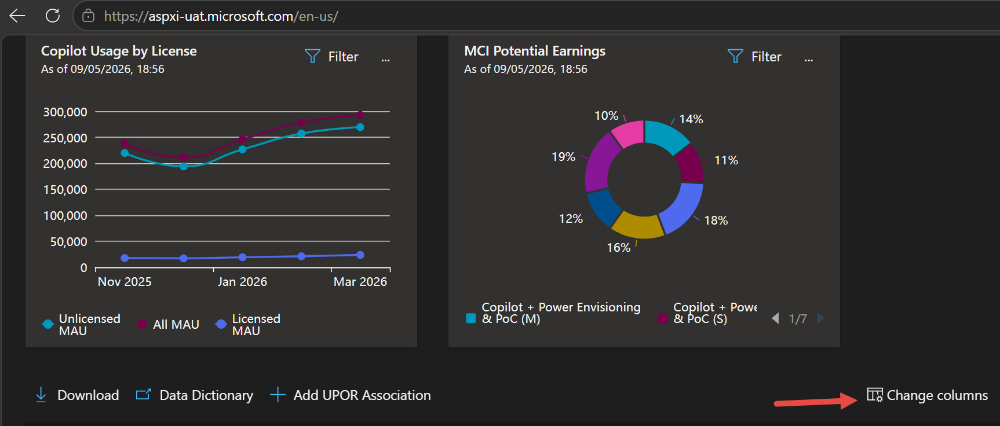
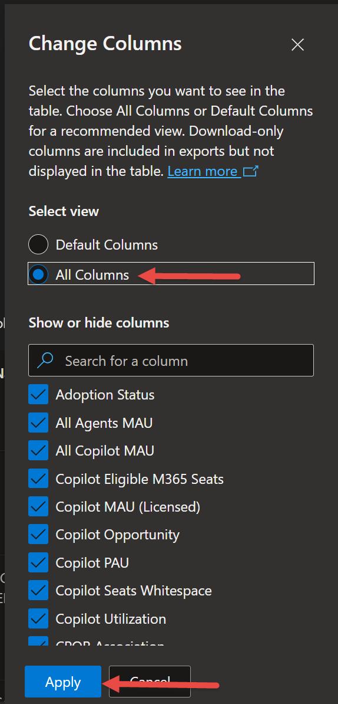
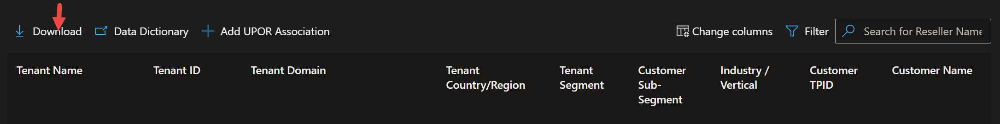
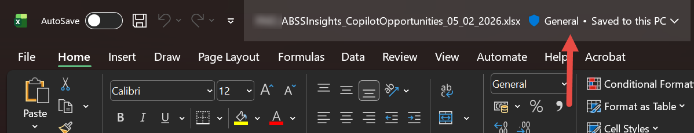
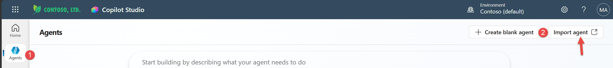
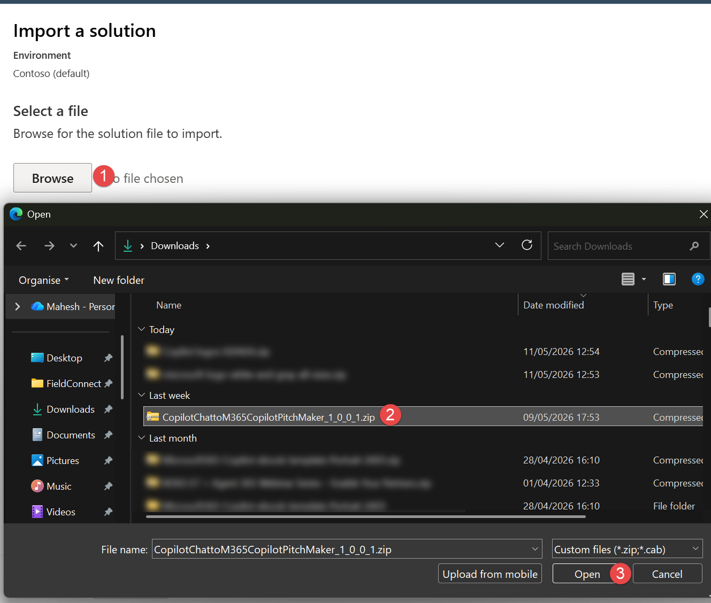
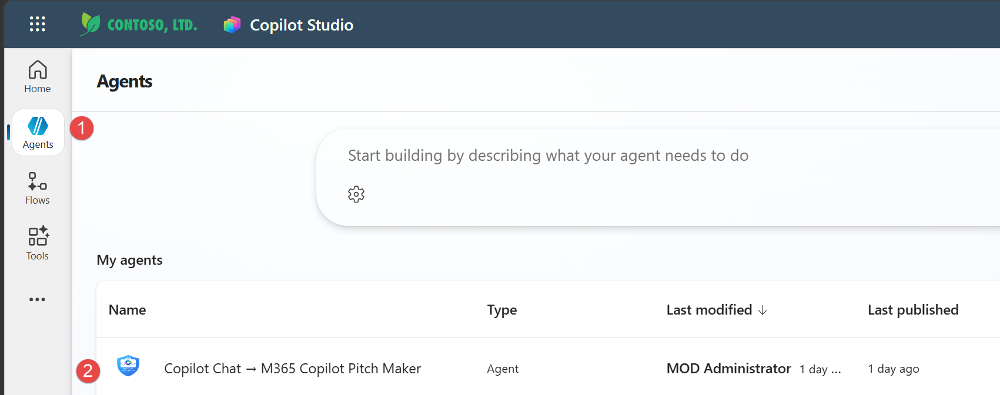
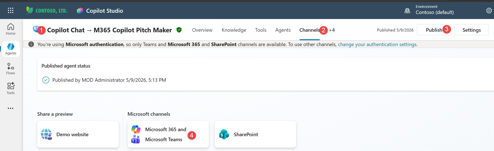
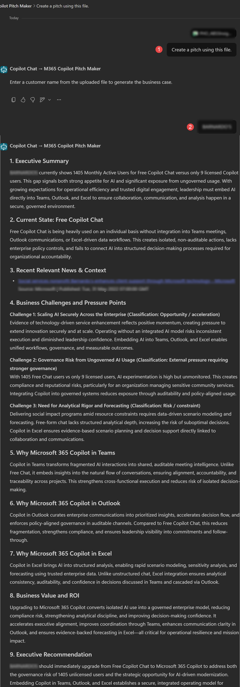
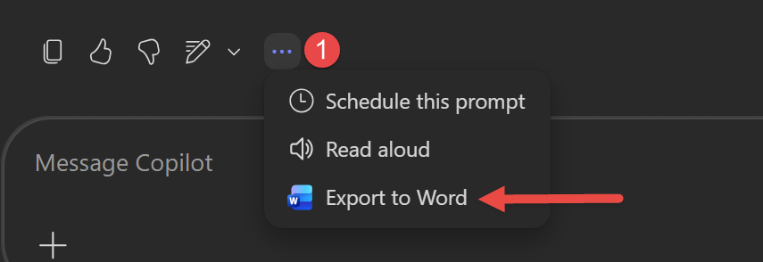

# Run Copilot Chat -> M365 Copilot Pitch Maker Agent (BETA)

Use this guide to deploy and run the Agent (BETA) solution package in this repository. For solution context and value proposition, see the [overview guide](README.md).

## Prerequisites

| Requirement | Details |
| ----------- | ------- |
| Microsoft 365 tenant | Active tenant with access to Copilot Studio and Partner Center |
| Copilot Studio access | Permission to import and configure Agent (BETA) solutions |
| Partner Center access | Access to AI Business Solutions and Security Insights data |
| Local repository files | This repository downloaded locally |

## Solution Package Location

The Agent (BETA) solution package is provided in the Agent folder:

> Note: The Agent folder contains the latest available package version. Check the exact file name in that folder before importing.

- [Agent/CopilotChattoM365CopilotPitchMaker_1_0_0_X.zip](./Agent/CopilotChattoM365CopilotPitchMaker_1_0_0_X.zip)

## Required Input Data

The Agent (BETA) uses a dataset exported from Partner Center Copilot growth opportunities (ASPX) as its primary input. This file is provided directly in the Agent (BETA) prompt—no knowledge source configuration in Copilot Studio is required.

To get started:

1. Export the Copilot growth opportunities data from Partner Center ASPX, following the steps in this guide (see "Prepare Data").
2. When prompted by the Agent (BETA), upload the exported file. The agent will use this file to generate tailored business case recommendations and outputs.

**Note:** After uploading the file, you can provide multiple customer names in the Agent (BETA) prompt. Submit each customer name one after another to create upgrade pitches for each customer.

Reference: [Copilot growth opportunities data in Partner Center](https://learn.microsoft.com/partner-center/insights/growth-opportunities-data/copilot)

## Deployment Steps

### 1. Prepare Data

1. Export your Copilot opportunity dataset from Partner Center ASPX:
   - **Step 1:** In the Copilot Opportunities tab, select **Change Column** before downloading the file.
     
   - **Step 2:** In the column selection dialog, choose **All Columns** to ensure all relevant data is included.
     
   - **Step 3:** Download the file after confirming all columns are selected.
     
   - **Step 4:** After downloading, ensure the file's sensitivity label is set so the Agent (BETA) can access it (remove or lower sensitivity if needed).
     

2. Confirm required columns are present for usage, whitespace, and opportunity signals.
3. Keep this exported file ready for upload in the Agent (BETA) prompt after deployment.

### 2. Import the Agent (BETA) Solution

1. Open [Copilot Studio](https://copilotstudio.microsoft.com/) in your target environment. If your team uses the preview experience, you can use [Copilot Studio (Preview)](https://copilotstudio.preview.microsoft.com/) instead.
   

2. Import the solution package from [Agent/CopilotChattoM365CopilotPitchMaker_1_0_0_X.zip](Agent/CopilotChattoM365CopilotPitchMaker_1_0_0_X.zip).
   
   Reference: [Import the solution with your agent](https://learn.microsoft.com/microsoft-copilot-studio/authoring-solutions-import-export?tabs=webApp#import-the-solution-with-your-agent)

3. Verify the Agent (BETA) and dependencies are successfully imported.
   
   Reference: [Export and import agents using solutions](https://learn.microsoft.com/microsoft-copilot-studio/authoring-solutions-import-export?tabs=webApp)

4. After importing, publish the Agent (BETA) and make it available in M365 Copilot and Teams channel. This allows users to interact with the agent directly from M365 Copilot or Teams, without needing access to Copilot Studio.
   
   Reference: [Publish and deploy your agent](https://learn.microsoft.com/microsoft-copilot-studio/publication-fundamentals-publish-channels) and [Connect and configure an agent for Teams and Microsoft 365](https://learn.microsoft.com/microsoft-copilot-studio/publication-add-bot-to-microsoft-teams)

### 3. Run the Pitch Generation Flow

1. In the Agent (BETA) prompt, upload the exported Partner Center file to begin.
2. Agent (BETA) will ask to select the customer account.
3. Start the guided conversation.
4. Generate the business case output.
5. Refine language and account context as needed.
6. Use the output in customer briefings and value-driven engagement motions.

Example output view:

To further enhance or enrich the generated content, export the agent interaction to Word.

## Post-Run Checklist

1. Validate key metrics in the generated narrative against source data.
2. Tailor messaging for business and IT stakeholders before external sharing.

## Troubleshooting

### Import Fails

- Ensure you are importing the package from the latest package file in the Agent folder (for example: [Agent/CopilotChattoM365CopilotPitchMaker_1_0_0_X.zip](./Agent/CopilotChattoM365CopilotPitchMaker_1_0_0_X.zip)).
- Confirm your environment has the required solution import permissions.

### Recommendations Feel Generic

- Check that customer selection is correct and data is fresh.
- Include additional account context in prompts when refining output.

## ⚠️ Disclaimer

AI-generated outputs should be reviewed, validated, and tailored where necessary before external sharing.

## Additional References

- [Overview guide](./README.md)
- [Partner Center - Copilot growth opportunities data](https://learn.microsoft.com/partner-center/insights/growth-opportunities-data/copilot)
